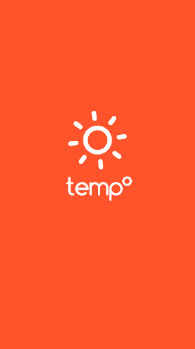

# temp°

A React.js + Cordova App targeting the Web, iOS and Android.

## Usage

    npm install

To run project locally do

    npm start

webpack will bundle the project and start a server available at `localhost:8080`

## updating site
If you'd like to update the site build and push onto the gh-pages branch.
Run

    npm run build

and push the branch to github. This flow prevents re-build clutter from
appearing in the git log.

## License

MIT
